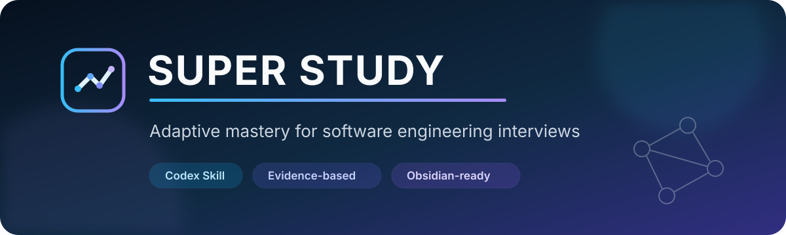
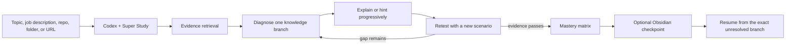

<p align="center">
  
</p>

<h1 align="center">Super Study</h1>

<p align="center">
  An open-source Codex Skill for adaptive, evidence-based mastery of software engineering interview topics.
</p>

<p align="center">
  <a href="https://github.com/Loffee5422/super-study/actions/workflows/validate.yml"></a>
  <a href="LICENSE"></a>
  <a href="https://github.com/Loffee5422/super-study/stargazers"></a>
  
  
</p>

<p align="center">
  <a href="docs/USAGE.zh-CN.md">中文使用指南</a> ·
  <a href="docs/ARCHITECTURE.md">Architecture</a> ·
  <a href="docs/DEVELOPMENT.md">Development</a> ·
  <a href="CONTRIBUTING.md">Contributing</a>
</p>

Super Study turns Codex into a progressive learning coach for frontend, backend, data, AI, agents, networking, and cybersecurity interviews. It diagnoses gaps one question at a time, retrieves evidence from connected MCP sources or user-provided material, and keeps probing until the learner can explain, apply, debug, compare, and transfer the concept without material hints.

The optional Obsidian integration stores durable learning state without moving execution into Markdown. Codex remains the reasoning and teaching layer; the Vault is a compact, navigable memory system.

## Why Super Study

- **Mastery over coverage:** completion requires observable evidence, not “I understand.”
- **Progressive disclosure:** one branch and one question at a time; hints escalate only when needed.
- **Interview-oriented depth:** mechanism, implementation, debugging, tradeoffs, failures, security, and novel transfer.
- **Evidence-grounded learning:** connected MCP sources first, then official documentation, standards, papers, repositories, files, or URLs.
- **Job-description targeting:** prioritize the concepts and project difficulties that matter to a specific role.
- **Three learning tracks:** technical interviews, resume/project defense, and behavioral interviews.
- **Obsidian-ready continuity:** resume across Codex tasks through compact topic, concept, session, source, and target notes.
- **Duplicate-resistant concepts:** canonical IDs, aliases, domains, and resolution checks keep the knowledge graph consistent.
- **Safe by default:** source repositories are read-only unless the user explicitly authorizes changes; cybersecurity work requires an authorized, isolated target.

## How it works



Super Study verifies recall, causal mechanism, practical use, boundaries, failure modes, tradeoffs, security implications, transfer, and interview follow-ups. A topic is complete only when every material dimension has evidence.

## Install

### Ask Codex to install it

Give Codex this repository URL and ask:

```text
Install the super-study skill from
https://github.com/Loffee5422/super-study/tree/main/skills/super-study
```

### Install manually

Clone the repository, then copy `skills/super-study` into your personal Codex skills directory.

macOS or Linux:

```bash
git clone https://github.com/Loffee5422/super-study.git
mkdir -p ~/.codex/skills
cp -R super-study/skills/super-study ~/.codex/skills/
```

Windows PowerShell:

```powershell
git clone https://github.com/Loffee5422/super-study.git
New-Item -ItemType Directory -Force "$env:USERPROFILE\.codex\skills" | Out-Null
Copy-Item -Recurse ".\super-study\skills\super-study" "$env:USERPROFILE\.codex\skills\"
```

Restart Codex after installation so the Skill catalog refreshes.

## Use

Invoke the Skill explicitly with `$super-study`, or describe a matching learning goal naturally.

```text
Use $super-study to help me master database indexing for a backend interview.
```

```text
Use $super-study to analyze this job description and build a mastery path around its highest-value requirements: [paste JD]
```

```text
Use $super-study to deeply defend the architecture and tradeoffs in this GitHub project: [repository URL]
```

```text
Use $super-study to turn my experience into strong behavioral interview stories without inventing details.
```

You can provide a GitHub repository, local project folder, file, pasted link, job description, or resume project. If no source is supplied, the Skill prefers available MCP or connected search sources and authoritative primary material.

## Optional Obsidian learning record

The Skill works without Obsidian. To preserve learning state across tasks, configure a Vault with the included deterministic CLI:

```bash
python skills/super-study/scripts/super_study.py configure \
  --vault "/absolute/path/to/your/vault" --consent --create
python skills/super-study/scripts/super_study.py init
python skills/super-study/scripts/super_study.py validate
```

The generated Vault uses small navigation indexes and loads only the current Topic, latest relevant Session, and needed Concepts or Sources. It never requires importing the full Vault into context.

```text
00 Home/       navigation and usage guide
10 Topics/     learning maps and mastery contracts
20 Concepts/   canonical reusable concepts
30 Sessions/   append-only learning evidence
40 Sources/    URLs, repositories, documents, and versions
50 Reviews/    review records and spaced-retrieval evidence
60 Targets/    job descriptions and interview targets
90 Templates/  reusable note templates
.super-study/  disposable machine indexes
```

The Vault path and consent state live in a local user configuration file. They are not included in this repository.

## Repository layout

```text
skills/super-study/
├── SKILL.md                    routing and core behavior
├── agents/openai.yaml          Codex interface metadata
├── references/                 lazily loaded learning protocols
├── scripts/super_study.py      deterministic Vault operations
└── assets/vault-templates/     Obsidian notes and user guide
```

The modular design keeps the base Skill small. Codex reads only the track and reference material required for the current request, which reduces input-token use and makes the system easier to maintain.

## Scope

Super Study prioritizes common concepts and realistic project difficulties that appear in software engineering work and interviews. It intentionally deprioritizes obscure trivia and excessively narrow details unless a job description, project, or source makes them relevant.

This project is a learning tool, not a guarantee of interview results. For cybersecurity topics, use only systems you own or are explicitly authorized to test.

## Contributing

Issues, learning-track proposals, protocol improvements, and reproducible bugs are welcome. Read [CONTRIBUTING.md](CONTRIBUTING.md) and [SECURITY.md](SECURITY.md) before contributing.

## License

Released under the [MIT License](LICENSE).
